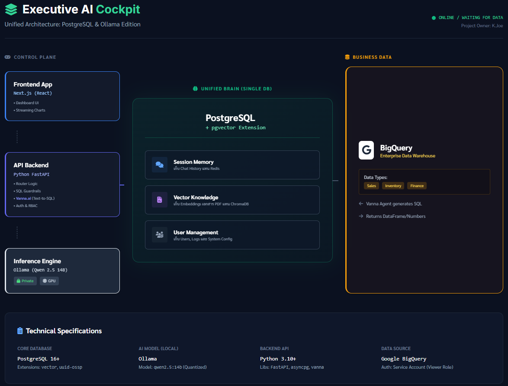

<div align="center">

# Executive AI Cockpit

### AI Analytic Secretary

**A local-first AI Data Analyst that lets executives chat with their data using natural language.**


</div>

---

## Overview

**Executive AI Cockpit** is a privacy-first, self-hosted AI analytics platform designed for business executives. It connects directly to your BigQuery data warehouse and translates plain English questions into SQL queries -- no data leaves your infrastructure.

Ask questions like *"What were our top 5 revenue sources last quarter?"* and get instant answers powered by a locally running LLM. All conversation history and learned context are stored in a RAG-enabled PostgreSQL database, so the system gets smarter over time.

---

## Architecture



```
                    +------------------+
                    |   Executive UI   |
                    |  (Next.js :3000) |
                    +--------+---------+
                             |
                             v
                    +------------------+
                    |   Backend API    |
                    | (FastAPI :8000)  |
                    +---+-----+----+--+
                        |     |    |
               +--------+    |    +--------+
               v              v             v
      +-----------+   +-----------+   +-----------+
      |  Ollama   |   | PostgreSQL|   |  BigQuery |
      | Qwen 2.5  |   | + pgvector|   | (External)|
      |  (:11434) |   |  (:5432)  |   |           |
      +-----------+   +-----------+   +-----------+
       Local LLM      RAG Memory     Data Warehouse
```

---

## Key Features

| Feature | Description |
|---|---|
| **Natural Language to SQL** | Ask questions in plain English. Vanna.ai translates them into optimized SQL queries against BigQuery. |
| **100% Local & Private** | The LLM runs locally via Ollama. Your data and queries never leave your network. |
| **RAG Memory** | PostgreSQL with pgvector stores past queries and schema context, improving accuracy over time. |
| **Dark Glassmorphism UI** | A sleek, executive-grade dashboard built with Next.js and Tailwind CSS. |
| **Fully Containerized** | One command (`docker compose up`) spins up the entire stack -- no complex setup required. |
| **BigQuery Integration** | Connects to Google BigQuery using a service account for secure, read-only data access. |

---

## Tech Stack

| Layer | Technology |
|---|---|
| **Frontend** | Next.js 14, React 18, Tailwind CSS, TypeScript |
| **Backend** | Python, FastAPI, Uvicorn |
| **AI / LLM** | Ollama (Qwen 2.5 - 14B) |
| **SQL Generation** | Vanna.ai |
| **Database** | PostgreSQL 16 + pgvector |
| **Data Warehouse** | Google BigQuery |
| **Orchestration** | Docker Compose |

---

## Prerequisites

Before you begin, ensure you have the following installed:

- **Docker Desktop** (v4.x or later) -- [Download](https://www.docker.com/products/docker-desktop/)
- **RAM:** 16 GB minimum (the 14B model is memory-intensive)
- **GPU (recommended):** NVIDIA GPU with CUDA support for faster LLM inference
- **Google Cloud Service Account** JSON key file with BigQuery read access

> **Note:** The system will run on CPU-only machines, but responses will be significantly slower without a GPU.

---

## Installation & Setup

### 1. Clone the repository

```bash
git clone https://github.com/your-org/ai-analytic-secretary.git
cd ai-analytic-secretary
```

### 2. Add your GCP credentials

Place your Google Cloud service account JSON file in the backend directory:

```bash
cp /path/to/your/service-account.json ./backend/gcp-service-account.json
```

### 3. Configure environment variables (optional)

The default values work out of the box. To customize, create a `.env` file in the project root:

```env
POSTGRES_USER=admin
POSTGRES_PASSWORD=admin
POSTGRES_DB=ai_cockpit
```

### 4. Enable GPU support (optional)

If you have an NVIDIA GPU, uncomment the GPU section in `docker-compose.yml` under the `ollama` service:

```yaml
deploy:
  resources:
    reservations:
      devices:
        - driver: nvidia
          count: 1
          capabilities: [gpu]
```

### 5. Start the stack

```bash
docker compose up -d
```

### 6. Pull the LLM model

On first run, pull the Qwen 2.5 model into Ollama:

```bash
docker exec -it ai_cockpit_brain ollama pull qwen2.5:14b
```

> This download is approximately **9 GB** and only needs to be done once.

---

## Usage

Once all containers are running, open your browser and navigate to:

| Service | URL |
|---|---|
| **Frontend (Dashboard)** | [http://localhost:3000](http://localhost:3000) |
| **Backend API** | [http://localhost:8000](http://localhost:8000) |
| **API Docs (Swagger)** | [http://localhost:8000/docs](http://localhost:8000/docs) |

### Asking a question

1. Open the dashboard at **http://localhost:3000**
2. Type a natural language question in the chat input, for example:
   - *"Show me total revenue by region for Q4 2024"*
   - *"Who are our top 10 customers by order count?"*
   - *"Compare monthly sales between 2023 and 2024"*
3. The AI engine will generate the SQL, execute it against BigQuery, and return the results.

---

## Project Structure

```
ai-analytic-secretary/
├── backend/                # FastAPI application
│   ├── main.py             # API endpoints & Vanna.ai setup
│   ├── Dockerfile
│   └── requirements.txt
├── frontend/               # Next.js dashboard
│   ├── src/
│   ├── Dockerfile
│   └── package.json
├── docker-compose.yml      # Service orchestration
├── ollama_data/            # Persisted LLM model data
├── pgdata/                 # Persisted PostgreSQL data
└── README.md
```

---

## License

This project is for internal use. All rights reserved.

---

<div align="center">

Built with local-first AI principles. Your data stays yours.

</div>
